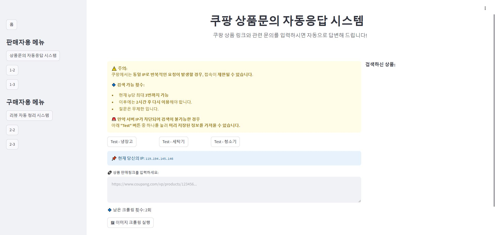

# 생성형 AI 기반 쇼핑몰(쿠팡) 상담챗봇 및 답글생성 개발

(https://xn--qa-o93kp1i.store/)

링크 : [쿠팡qa.store](https://xn--qa-o93kp1i.store/)

## 프로젝트 개요
쿠팡같은 쇼핑몰은 현재 수많은 사람들이 사용중이며 그중 판매자는 본인의 제품에 대해 더 좋은 평점을 받기 위해 상품리뷰, 상품문의 같은 구매자들의 요구에 성실하게 답하여야 한다. 지금은 직원이 하나하나 답변을 작성하고 있어 노동력이 요구되는것을 AI를 통해 자동답변이 가능하도록 함으로서 판매자의 편의성을 개선하고자 한다.

또한 모델이 각 상품의 상세설명을 학습하고 구매자들의 'Needs, Wants, Demands'를 파악해 챗봇 형태 상담을 통한 제품을 추천하는 AI를 구현하고자 한다.

## 프로젝트 목표
1. AI 모델이 상품 설명을 학습하여 상품리뷰, 상품문의에 대해 자동으로 자연스럽고, 질문에 대한 정확한 답변을 하도록 설계한다.

2. 학습한 정보들을 토대로 소비자들과 상담하여 LLM을 기반으로 고민, 특징에 대한 적절한 상품을 추천해주는 챗봇을 구현한다.

3. 위 기능이 실현되는 것을 확인할 수 있도록 웹페이지를 구현한다. 구매자가 쇼핑몰의 재품에 대한 상담을 할수있는 채팅박스와 재품문의를 받았을 경우(가정) 자동으로 답변해주는 예시를 보여줄 수 있도록.

## 기능요구사항
### 1. 구매자 문의에 대해 CS 답변 제공 (배송, 결제, 제품 소개, 이벤트, 기타)
- 기계적인 답변이 아닌 고객을 응대하는 판매자같이 자연스럽게 말하기

ex)    
카메라가 달려있나요? --> 네, 제품 상단에 부착되어있습니다  
반품하고 싶어요. --> 반품신청을 하시면 반품절차가 진행됩니다. 그러나 단순변심의 경우 ...  
배송이 왜이렇게 늦나요? --> 현재 제품 수요량이 과포화 상태로 ... 배송이 늦어진점 죄송합니다.

### 2. 소비자가 원하는것이 무엇인지 챗봇 형태의 상담을 통해 제품 추천
- 단순 필터에 따른 제품 나열이 아닌 상담형식으로 소비자의 고민, 특징 등을 통해 제품 추천

ex)  
난 고등학생인데 학교가 언덕 위에 있어서 등하교 하는게 너무 힘들어  
LLM --> 공감 --> 고민에 따라 전기자전거 추천 --> 학생임으로 저렴한 모델 추천

### 3. 고객이 긍정적인 댓글/부정적인 리뷰에 대해 자동으로 댓글 생성
- 댓글은 일정 템플릿에 따라 생성. 단, 항상 똑같은 감사/사과가 아닌 고객 리뷰에 따라 자연스럽게 보이도록 생성형 AI를 적극 활용

(1) 긍정적 리뷰의 경우 댓글 --> 감사의 글, 현재 제품 외에 같이 쓰면 좋은 제품 추천, 추가 구매에 대한 권유 순  
(2) 부정적 리뷰의 경우 댓글 --> 사과의 글, 향후 개선을 위한 노력, 다시 사과의 글, 재방문하면 권유 순

## 사용자요구사항
사용자중 판매자는 이 AI 모델을 통해 업무 부담을 줄이고 고객 만족도를 높이고 싶어한다.  
사용자중 구매자는 빠르고 신뢰성 있는 상담과 맞춤형 제품 추천, 질문에 대한 친절하고 정확한 답변을 원한다.